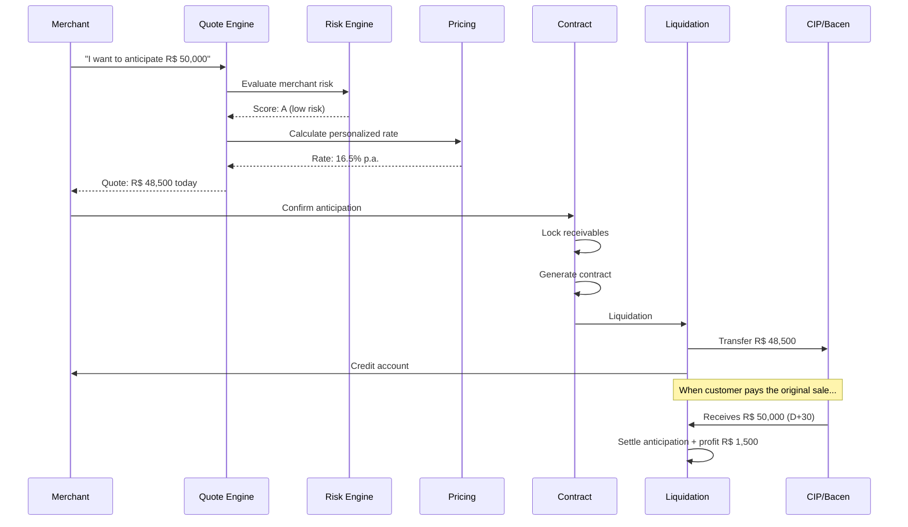
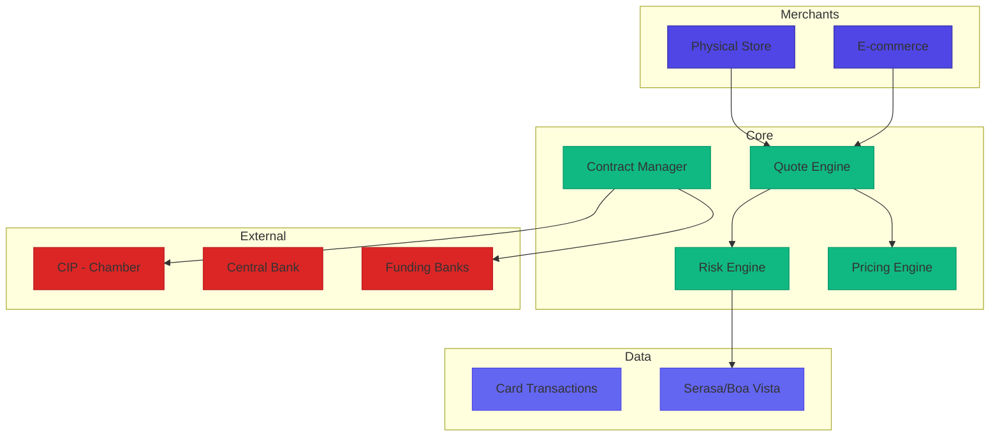

# Challenge 16: Receivables Financing — The R$ 500B Market That Moves Brazil

**🇧🇷** Crédito sobre Vendas Futuras  
**🇬🇧** Receivables Financing

---

**Receivables Financing** allows merchants to receive **today** the value of credit card sales that would only be paid in **30, 60 or 90 days**. It moves over **R$ 500 billion per year** and is the main revenue source for Stone, PagSeguro and Mercado Pago.

## Switch: TypeScript vs Go

<LanguageToggle />

<div class="lang-content ts" style="display:block;">

### What is Receivables Financing?

| Concept | Description |
|---------|-------------|
| **D+30** | Standard payment receipt period (30 days) |
| **MDR** | Acquirer fee (1.5-3% per transaction) |
| **Spread** | Bank margin on anticipation (2-8% p.a.) |
| **IOF** | Tax: 0.38% + 0.0041% per day |
| **CET** | Annualized Total Effective Cost |
| **FIDC** | Credit Rights Investment Fund |

### The Math

```typescript
// Anticipation of R$ 10,000 in 30 days
const futureValue = 10000;
const days = 30;
const annualRate = 0.18; // 18% p.a. (CDI + spread)
const iof = 0.0038 + (0.000041 * days);
const fixedFee = 10;

const dailyRate = Math.pow(1 + annualRate, 1/365) - 1;
const discount = futureValue * (Math.pow(1 + dailyRate, days) - 1);
const iofAmount = futureValue * iof;
const netAmount = futureValue - discount - iofAmount - fixedFee;

// Net Amount: R$ 9,795.33
// CET: 18.00% p.a.
```

### Complete Flow



### Architecture



### Pricing Engine

```typescript
export class PricingEngine {
  public async calculateQuote(merchantId: string, receivables: Receivable[]) {
    const cdiRate = await this.marketData.getCDIRate();
    const riskPremium = this.calculateRiskPremium(merchant);
    const spread = this.calculateSpread(merchant);
    const totalRate = cdiRate + spread + riskPremium;

    let grossAmount = 0, discountAmount = 0, iofAmount = 0;

    for (const r of receivables) {
      const days = r.daysUntilPayment();
      const dailyRate = Math.pow(1 + totalRate, 1/365) - 1;
      const discount = r.netAmount * (Math.pow(1 + dailyRate, days) - 1);
      const iof = r.netAmount * (0.0038 + 0.000041 * days);

      grossAmount += r.netAmount;
      discountAmount += discount;
      iofAmount += iof;
    }

    return {
      grossAmount, discountAmount, iofAmount,
      netAmount: grossAmount - discountAmount - iofAmount - 10,
      effectiveRate: this.calculateCET(grossAmount, grossAmount - discountAmount - iofAmount, avgDays),
    };
  }
}
```

### Risk Engine

```typescript
export class RiskEngine {
  public async evaluate(input: RiskEvaluationInput) {
    const creditData = await this.creditBureau.query({ document: merchant.document });
    const history = await this.historyRepo.findByMerchant(input.merchantId, { months: 12 });
    const fraudCheck = await this.fraudService.evaluateAnticipation({ ... });

    const finalScore = Math.round(
      creditData.score * 0.35 +
      this.calculateHistoryScore(history) * 0.30 +
      this.calculateBehaviorScore(merchant, input) * 0.20 +
      fraudCheck.score * 0.15
    );

    return {
      approved: finalScore >= 500 && input.totalAmount <= limits.maxAmount,
      score: finalScore,
      riskLevel: finalScore >= 800 ? 'LOW' : finalScore >= 650 ? 'MEDIUM' : 'HIGH',
    };
  }
}
```

### Comparison: TypeScript vs Go

| Aspect | TypeScript | Go |
|--------|-----------|-----|
| **Math** | Number (ok) | shopspring/decimal |
| **Batch** | Worker threads | Goroutines |
| **1M receivables** | ~14 minutes | ~80 seconds |
| **Quote P99** | 180-1200ms | 45-280ms |
| **Memory** | ~2GB | ~100MB |

### Real Cases

- **Stone** (Go) — Leader, R$ 100B+/year, P99 < 200ms
- **PagSeguro** (Go + Java) — 40M customers, auto-anticipation
- **Mercado Pago** (Go) — Largest in Latam, dynamic pricing
- **Creditas** (Go) — SME niche, own FIDC

</div>

<div class="lang-content go" style="display:none;">

### Domain — Receivable Entity

```go
package domain

import (
    "errors"
    "time"
    "github.com/google/uuid"
)

type ReceivableStatus string

const (
    StatusPending     ReceivableStatus = "PENDING"
    StatusPaid        ReceivableStatus = "PAID"
    StatusAnticipated ReceivableStatus = "ANTECIPATED"
    StatusChargedBack ReceivableStatus = "CHARGED_BACK"
)

type Receivable struct {
    ID          string
    MerchantID  string
    CardBrand   string
    GrossAmount int64 // cents
    NetAmount   int64 // after MDR
    PaymentDate time.Time
    Status      ReceivableStatus
}

func (r *Receivable) DaysUntilPayment(from time.Time) int {
    days := int(time.Until(r.PaymentDate).Hours() / 24)
    if days < 0 { days = 0 }
    return days
}

func (r *Receivable) CanBeAnticipated() bool {
    return r.Status == StatusPending && r.DaysUntilPayment(time.Now()) > 0
}
```

### Pricing Engine with decimal

```go
package pricing

import (
    "context"
    "math"
    "github.com/shopspring/decimal"
)

type Engine struct {
    merchantRepo  MerchantRepository
    marketData    MarketDataService
}

func (e *Engine) CalculateQuote(ctx context.Context, merchantID string, receivables []*domain.Receivable) (*QuoteResult, error) {
    cdiRate, _ := e.marketData.GetCDIRate(ctx)
    riskPremium := e.calculateRiskPremium(merchant)
    spread := e.calculateSpread(merchant)

    totalRate := cdiRate.Add(spread).Add(riskPremium)
    one := decimal.NewFromInt(1)
    dailyRate := one.Add(totalRate).Pow(one.Div(decimal.NewFromInt(365))).Sub(one)

    var grossAmount, discountAmount, iofAmount int64
    var weightedDays, totalWeight int64

    for _, r := range receivables {
        days := int64(r.DaysUntilPayment(time.Now()))
        factor := one.Add(dailyRate).Pow(decimal.NewFromInt(days))
        discount := decimal.NewFromInt(r.NetAmount).Mul(factor.Sub(one))
        iof := decimal.NewFromInt(r.NetAmount).Mul(decimal.NewFromFloat(0.0038 + 0.000041*float64(days)))

        grossAmount += r.NetAmount
        discountAmount += discount.IntPart()
        iofAmount += iof.IntPart()
        weightedDays += days * r.NetAmount
        totalWeight += r.NetAmount
    }

    netAmount := grossAmount - discountAmount - iofAmount - 10
    avgDays := weightedDays / totalWeight
    effectiveRate := math.Pow(float64(grossAmount)/float64(netAmount), 365.0/float64(avgDays)) - 1.0

    return &QuoteResult{
        GrossAmount: grossAmount, NetAmount: netAmount,
        DiscountAmount: discountAmount, IOFAmount: iofAmount,
        EffectiveRate: effectiveRate, DaysToReceive: int(avgDays),
    }, nil
}
```

### Anticipation Use Case

```go
package usecase

func (uc *AnticipateUseCase) Execute(ctx context.Context, input AnticipateInput) (*AnticipateOutput, error) {
    if existing, _ := uc.idempotency.Check(ctx, input.IdempotencyKey); existing != nil {
        return existing.(*AnticipateOutput), nil
    }

    receivables := make([]*domain.Receivable, 0, len(input.ReceivableIDs))
    for _, id := range input.ReceivableIDs {
        r, _ := uc.receivableRepo.FindByID(ctx, id)
        if r == nil { return nil, domain.ErrReceivableNotFound }
        if r.MerchantID != input.MerchantID { return nil, domain.ErrInvalidOwnership }
        receivables = append(receivables, r)
    }

    riskResult, _ := uc.riskEngine.Evaluate(ctx, risk.EvaluationInput{...})
    if !riskResult.Approved { return nil, errors.New("rejected by risk") }

    quote, _ := uc.pricingEngine.CalculateQuote(ctx, input.MerchantID, receivables)

    contract := domain.NewAnticipationContract(...)
    uc.receivableRepo.LockForAnticipation(ctx, ids, contract.ID)
    uc.fundingService.RequestFunding(ctx, funding.Request{Amount: quote.NetAmount})
    uc.ledgerService.Credit(ctx, ledger.CreditRequest{Amount: quote.NetAmount})

    uc.eventPub.Publish(ctx, "anticipation.completed", map[string]interface{}{...})

    return &AnticipateOutput{ContractID: contract.ID, NetAmount: quote.NetAmount}, nil
}
```

### Batch Processor

```go
package jobs

func (p *DailyReceivableProcessor) Execute(ctx context.Context, date time.Time) error {
    files, _ := p.acquirerClient.DownloadReconciliationFiles(ctx, date)

    var wg sync.WaitGroup
    sem := make(chan struct{}, 50)

    for _, file := range files {
        wg.Add(1)
        go func(f AcquirerFile) {
            defer wg.Done()
            sem <- struct{}{}
            defer func() { <-sem }()
            p.processFile(ctx, f)
        }(file)
    }
    wg.Wait()
    return nil
}
```

### Benchmark

| Operation | TS | Go |
|-----------|----|----|
| Quote (10 receivables) | 45ms | 12ms |
| Quote (1K receivables) | 850ms | 140ms |
| Batch 1M receivables | ~14min | ~80s |
| Memory per instance | ~2GB | ~100MB |

### Real Cases

- **Stone** (Go) — Leader, 30K+ TPS, batch 50M+/day
- **PagSeguro** (Go + Java) — 40M customers, auto-anticipation
- **Mercado Pago** (Go) — Largest Latam, dynamic pricing
- **Creditas** (Go) — SME niche, own FIDC

</div>

---

## How to test

```bash
# TypeScript
pnpm --filter @banking/anticipation dev

# Go
cd packages/backend/anticipation-go
go run .

# Simulate quote
curl -X POST http://localhost:3010/anticipation/quote \
  -H "Content-Type: application/json" \
  -d '{"receivableIds":["uuid1","uuid2"]}'
```

---

## Lessons learned

1. **R$ 500B+/year** — Largest credit market in Brazil
2. **Precise math is critical** — Cents matter at scale
3. **shopspring/decimal** — Never native float for money in Go
4. **Batch processing** — 50M+ receivables/day in large acquirers
5. **Multi-layer risk engine** — Credit + history + behavior + fraud
6. **Funding sources** — Own capital, FIDCs, wholesale banks
7. **Chargeback is the biggest risk** — Merchant can disappear
8. **CET must be disclosed** — BACEN requirement
9. **Go processes 1M in 80s** — vs 14min in TypeScript
10. **Stone, PagSeguro and Mercado Pago** — All use Go in core
