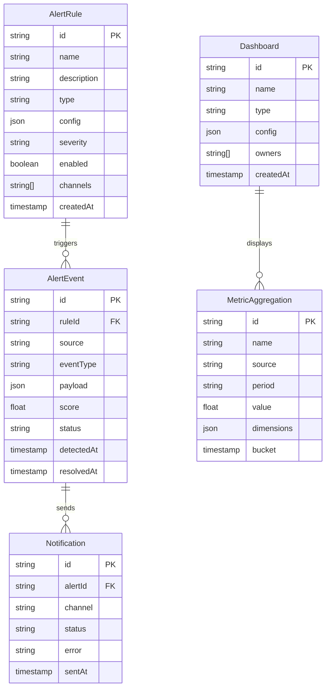

# RFC: Financial Monitoring System

**Status:** Draft  
**Author:** Banking Challenges Team  
**Date:** 2024-01-15  
**Version:** v0.1

---

## Problem Statement

### Context

Financial systems need real-time monitoring to detect anomalies, prevent fraud, ensure compliance, and maintain operational health. Pix transactions, account openings, registration changes, and other financial events need continuous monitoring.

This RFC proposes a **Financial Monitoring System** that analyzes events in real-time, triggers alerts, and generates operational dashboards.

### Goals

- Real-time monitoring of financial transactions
- Anomaly detection (unusual amounts, velocity, patterns)
- Compliance monitoring (regulatory limits, suspicious activity)
- Operational dashboards (SLAs, error rates, latency)
- Alerting (email, webhook, SMS)
- Historical trend analysis

### Non-Goals

- Replace specialized fraud detection systems
- Real-time transaction blocking (advisory only)
- Regulatory reporting (focus on internal monitoring)

---

## Proposed Solution

### Architecture Overview

```
┌─────────────────────────────────────────────────────────────────────┐
│                    Financial Monitoring System                        │
│                                                                      │
│  Data Sources                                                        │
│  ┌──────┐ ┌──────┐ ┌──────┐ ┌────────┐ ┌────────┐                │
│  │Pix   │ │DICT  │ │Ledger│ │Open Fin│ │KYC     │                │
│  └──┬───┘ └──┬───┘ └──┬───┘ └───┬────┘ └───┬────┘                │
│     │        │        │         │          │                        │
│  ┌──▼────────▼────────▼─────────▼──────────▼────────────────────┐ │
│  │                    Event Bus (Kafka/Redis PubSub)             │ │
│  └──────────────────────────────────────────────────────────────┘ │
│                              │                                      │
│  ┌────────────────────────── ▼ ──────────────────────────────────┐ │
│  │              Stream Processing                                  │ │
│  │                                                                  │ │
│  │  ┌────────────────┐  ┌────────────────┐  ┌────────────────┐  │ │
│  │  │ Rule Engine    │  │ Anomaly Detector│  │ Aggregator     │  │ │
│  │  │ ├─ amount > N  │  │ ├─ velocity     │  │ ├─ tx count    │  │ │
│  │  │ ├─ suspicious  │  │ ├─ amount dist  │  │ ├─ volume      │  │ │
│  │  │ │   patterns  │  │ ├─ geo anomaly  │  │ ├─ error rate  │  │ │
│  │  │ └─ compliance  │  │ └─ time anomaly │  │ └─ latency     │  │ │
│  │  └────────────────┘  └────────────────┘  └────────────────┘  │ │
│  └──────────────────────────────────────────────────────────────┘ │
│                              │                                      │
│  ┌────────────────────────── ▼ ──────────────────────────────────┐ │
│  │                Storage (PostgreSQL + Redis)                     │ │
│  │                                                                  │ │
│  │  ┌──────────────────────┐  ┌────────────────────────────────┐  │ │
│  │  │ PostgreSQL           │  │ Redis                          │  │ │
│  │  │ ├─ alerts            │  │ ├─ event buffer (stream)       │  │ │
│  │  │ ├─ rules             │  │ ├─ rate limit counters         │  │ │
│  │  │ ├─ dashboards        │  │ └─ real-time aggregations     │  │ │
│  │  │ └─ audit trail       │  │                                │  │ │
│  │  └──────────────────────┘  └────────────────────────────────┘  │ │
│  └──────────────────────────────────────────────────────────────┘ │
│                              │                                      │
│  ┌────────────────────────── ▼ ──────────────────────────────────┐ │
│  │                    Alerting & Notification                      │ │
│  │                                                                  │ │
│  │  ┌──────────┐  ┌──────────┐  ┌──────────┐  ┌──────────┐     │ │
│  │  │ Email    │  │ Webhook  │  │  Slack   │  │   SMS    │     │ │
│  │  └──────────┘  └──────────┘  └──────────┘  └──────────┘     │ │
│  └──────────────────────────────────────────────────────────────┘ │
│                              │                                      │
│  ┌────────────────────────── ▼ ──────────────────────────────────┐ │
│  │                    Dashboards (Metabase)                        │ │
│  │  ┌────────────────┐  ┌────────────────┐  ┌────────────────┐  │ │
│  │  │ Operations     │  │ Fraud          │  │ Compliance     │  │ │
│  │  │ ├─ SLAs        │  │ ├─ flagged tx  │  │ ├─ reg limits  │  │ │
│  │  │ ├─ error rates │  │ ├─ velocity    │  │ ├─ SAR        │  │ │
│  │  │ └─ latency     │  │ └─ patterns    │  │ └─ audit trail │  │ │
│  │  └────────────────┘  └────────────────┘  └────────────────┘  │ │
│  └──────────────────────────────────────────────────────────────┘ │
└─────────────────────────────────────────────────────────────────────┘
```

### Event Flow

```
Transaction Event
       │
       ▼
┌─────────────────┐
│ 1. Enrich       │
│ Add metadata:   │
│ user, geo, time │
└────────┬────────┘
         │
         ▼
┌─────────────────┐
│ 2. Evaluate     │
│ Check all rules │
│ against event   │
└────────┬────────┘
         │
    ┌────┴────┐
    │         │
   PASS      FAIL
    │         │
    │    ┌────▼────────┐
    │    │ 3. Create    │
    │    │ Alert record │
    │    │ in DB       │
    │    └────┬────────┘
    │         │
    │    ┌────▼────────┐
    │    │ 4. Notify   │
    │    │ Email/Slack │
    │    │ Webhook    │
    │    └────┬────────┘
    │         │
    ▼         ▼
┌─────────────────┐
│ 5. Update       │
│ Dashboard       │
│ metrics         │
└─────────────────┘
```

---

## Database Schema (Mermaid ERD)



### Key Tables

**Alert Rules**
| Column | Type | Description |
|--------|------|-------------|
| id | UUID | Primary key |
| name | VARCHAR(100) | Rule name |
| type | ENUM | amount_threshold, velocity, pattern, compliance |
| config | JSONB | Rule configuration |
| severity | ENUM | low, medium, high, critical |
| channels | TEXT[] | notification channels |

**Alert Events**
| Column | Type | Description |
|--------|------|-------------|
| id | UUID | Primary key |
| rule_id | UUID | Rule that triggered |
| source | VARCHAR(50) | Event source |
| event_type | VARCHAR(50) | Event type |
| payload | JSONB | Full event data |
| score | DECIMAL(5,2) | Risk score (0-100) |

### Example Rules

| Rule | Type | Config | Severity |
|------|------|--------|----------|
| Large Pix | amount_threshold | `{ "amount": { "gt": 50000 } }` | high |
| Velocity | velocity | `{ "count": 10, "window": "5m" }` | medium |
| Suspicious hours | time_anomaly | `{ "hours": [0, 5], "threshold": 1000 }` | low |
| New account activity | pattern | `{ "account_age_days": { "lt": 7 } }` | high |

---

## API Design

### Create Alert Rule

```http
POST /api/v1/monitoring/rules
Content-Type: application/json

{
  "name": "Large Pix Transaction",
  "description": "Alert on Pix transactions over R$50,000",
  "type": "amount_threshold",
  "config": {
    "source": "spi",
    "eventType": "pix.payment",
    "conditions": { "amount": { "gt": 50000 } }
  },
  "severity": "high",
  "channels": ["email", "slack"]
}
```

### List Alerts

```http
GET /api/v1/monitoring/alerts?status=open&severity=high&limit=20
```

### Acknowledge Alert

```http
PATCH /api/v1/monitoring/alerts/:id
Content-Type: application/json

{
  "status": "acknowledged",
  "assignedTo": "ops-team"
}
```

### Dashboard Metrics

```http
GET /api/v1/monitoring/metrics?source=spi&period=last_24h&aggregate=hour
```

---

## Trade-offs and Alternatives

| Alternative | Pros | Cons |
|-------------|------|------|
| **Rule-based (chosen)** | Simple, predictable, auditable | Limited for complex patterns |
| **ML-based anomaly** | Detects unknown patterns | Black box, harder to audit, training data needed |
| **Hybrid** | Best of both worlds | Two systems to maintain |
| **Third-party (e.g., Datadog)** | No infra, fast setup | Cost, data sovereignty |

**Chosen:** Rule-based with hybrid ML option for fraud detection

---

## Security Considerations

- **Data Sensitivity**: Alert payloads may contain PII/financial data
- **Access Control**: RBAC for rules and dashboards
- **Audit Trail**: All rule changes and alert actions logged
- **Rate Limiting**: Prevent alert storms
- **Encryption**: Alert data encrypted at rest and in transit
- **Retention**: Alerts retained for 90 days (configurable)

---

## Open Questions

- Should alerts be deduplicated within a time window?
- How to handle cascading alerts (dependent alerts)?
- What is the optimal aggregation window for dashboards?
- Should we support custom webhook integrations per tenant?
