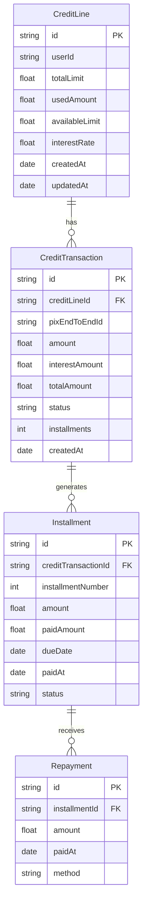

# RFC: Credit on top of Pix

**Status:** Draft  
**Author:** Banking Challenges Team  
**Date:** 2024-01-15  
**Version:** v0.1

---

## Problem Statement / Declaração do Problema

### 🇧🇷 Contexto

O Pix se consolidou como o principal meio de pagamento instantâneo no Brasil. No entanto, atualmente o Pix opera apenas como um sistema de débito — o pagador precisa ter saldo disponível para realizar a transação. Não existe uma camada de crédito nativa sobre o Pix.

Este RFC propõe uma arquitetura para um sistema de **crédito sobre Pix**, onde instituições financeiras podem oferecer linhas de crédito que são automaticamente acionadas quando o pagador não tem saldo suficiente, transformando a transação em uma operação de crédito.

### 🇬🇧 Context

Pix has become the main instant payment method in Brazil. However, currently Pix only operates as a debit system — the payer needs to have available balance to complete the transaction. There is no native credit layer on top of Pix.

This RFC proposes an architecture for a **credit on top of Pix** system, where financial institutions can offer credit lines that are automatically triggered when the payer has insufficient balance, converting the transaction into a credit operation.

### Goals / Objetivos

- Allow Pix payments even without sufficient balance
- Real-time credit decision and disbursement
- Transparent to the payee (receives Pix as usual)
- Configurable credit limits per user
- Interest and fee calculation

### Non-Goals / Não Objetivos

- Replace existing Pix infrastructure
- Define credit risk models
- Regulatory compliance specifics

---

## Proposed Solution / Solução Proposta

### Architecture Overview

```
┌─────────────────────────────────────────────────────────────────────┐
│                        Credit on Pix System                          │
│                                                                      │
│  Payer                          Credit Engine                 Payee  │
│    │                                  │                       │      │
│    │  1. Initiate Pix (insufficient)  │                       │      │
│    │ ────────────────────────────────►│                       │      │
│    │                                  │                       │      │
│    │  2. Check credit limit           │                       │      │
│    │                                  │                       │      │
│    │      ┌──────────────────────┐    │                       │      │
│    │      │ Credit Assessment    │    │                       │      │
│    │      │ ├─ User score        │    │                       │      │
│    │      │ ├─ Available limit   │    │                       │      │
│    │      │ ├─ Transaction risk  │    │                       │      │
│    │      │ └─ Approval decision │    │                       │      │
│    │      └──────────────────────┘    │                       │      │
│    │                                  │                       │      │
│    │  3. Credit approved (or denied)  │                       │      │
│    │ ◄────────────────────────────────│                       │      │
│    │                                  │                       │      │
│    │  4. Authorize Pix credit         │  5. Process Pix       │      │
│    │ ────────────────────────────────►│ ──────────────────────►│      │
│    │                                  │                       │      │
│    │  6. Receive confirmation         │                       │      │
│    │ ◄────────────────────────────────│ ◄─────────────────────│      │
│    │                                  │                       │      │
│    │  7. Repayment (installments)     │                       │      │
│    │ ────────────────────────────────►│                       │      │
│    │                                  │                       │      │
```

### Components / Componentes

1. **Credit Assessment Service** — Real-time credit scoring and limit checking
2. **Credit Ledger** — Tracks credit transactions, balances, and repayments
3. **Interest Engine** — Calculates interest, fees, and installment values
4. **Pix Integration** — Interfaces with SPI for payment processing
5. **Collection Service** — Manages repayment schedules and collections

---

## Database Schema (Mermaid ERD)



### Key Tables

**CreditLine**
| Column | Type | Description |
|--------|------|-------------|
| id | UUID | Primary key |
| user_id | UUID | User reference |
| total_limit | DECIMAL(15,2) | Maximum credit limit |
| used_amount | DECIMAL(15,2) | Currently used credit |
| interest_rate | DECIMAL(5,4) | Monthly interest rate |
| status | ENUM | active, frozen, closed |

**CreditTransaction**
| Column | Type | Description |
|--------|------|-------------|
| id | UUID | Primary key |
| credit_line_id | UUID | Credit line reference |
| pix_end_to_end_id | VARCHAR(35) | Pix transaction ID |
| amount | DECIMAL(15,2) | Original transaction amount |
| interest_amount | DECIMAL(15,2) | Total interest charged |
| status | ENUM | pending, active, paid, defaulted |

---

## API Design

### Create Credit Transaction

```http
POST /api/v1/credit/transactions
Content-Type: application/json

{
  "userId": "usr_abc123",
  "pixEndToEndId": "E2E2024011512345678",
  "amount": 1500.00,
  "installments": 6
}
```

**Response:**
```json
{
  "id": "ctr_xyz789",
  "status": "approved",
  "amount": 1500.00,
  "interestAmount": 135.00,
  "totalAmount": 1635.00,
  "installments": [
    { "number": 1, "amount": 272.50, "dueDate": "2024-02-15" },
    { "number": 2, "amount": 272.50, "dueDate": "2024-03-15" },
    { "number": 3, "amount": 272.50, "dueDate": "2024-04-15" },
    { "number": 4, "amount": 272.50, "dueDate": "2024-05-15" },
    { "number": 5, "amount": 272.50, "dueDate": "2024-06-15" },
    { "number": 6, "amount": 272.50, "dueDate": "2024-07-15" }
  ]
}
```

### Repay Installment

```http
POST /api/v1/credit/installments/:id/repay
Content-Type: application/json

{
  "amount": 272.50,
  "method": "pix"
}
```

---

## Trade-offs and Alternatives / Trade-offs e Alternativas

| Alternative | Pros | Cons |
|-------------|------|------|
| **Embedded credit at PSP** | Faster integration, no separate infrastructure | Vendor lock-in, limited customization |
| **Pre-approved credit line** | Instant approval, good UX | Risk of over-credit, requires credit modeling |
| **Post-paid settlement** | Simple, no real-time decision | Settlement risk, longer time to funds |
| **Installment-based** | Predictable payments, lower risk | Complexity in interest calculation |

**Chosen:** Pre-approved credit line with installment-based repayment

---

## Security Considerations / Considerações de Segurança

- **PCI DSS**: Credit card data handling must comply
- **LGPD**: User credit data is sensitive personal information
- **Encryption**: All PII and financial data encrypted at rest
- **Authentication**: OAuth 2.0 for API access
- **Rate Limiting**: Prevent abuse of credit assessment endpoints
- **Audit Trail**: All credit decisions and modifications logged
- **Fraud Detection**: Real-time anomaly detection on credit usage

---

## Open Questions / Questões em Aberto

- Should credit lines be dynamically adjusted based on usage patterns?
- What is the optimal interest rate model (fixed, tiered, risk-based)?
- How to handle cross-institution credit on Pix?
- What regulatory approvals would be needed?
