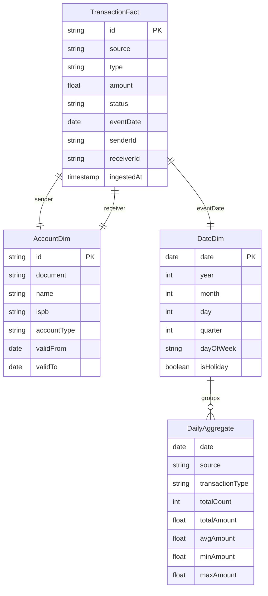

# RFC: Data Lake for Fintech

**Status:** Draft  
**Author:** Banking Challenges Team  
**Date:** 2024-01-15  
**Version:** v0.1

---

## Problem Statement / Declaração do Problema

### 🇧🇷 Contexto

Instituições financeiras processam milhões de transações por dia. Os dados gerados precisam ser armazenados, processados e analisados para relatórios, compliance, detecção de fraudes e insights de negócio. Sistemas transacionais (OLTP) não são adequados para análise em larga escala.

Este RFC propõe um **Data Lake** para fins analíticos, capaz de ingerir dados de múltiplas fontes (SPI, DICT, Ledger, Open Finance) e disponibilizá-los para consultas e relatórios.

### 🇬🇧 Context

Financial institutions process millions of transactions daily. The generated data needs to be stored, processed, and analyzed for reports, compliance, fraud detection, and business insights. Transactional systems (OLTP) are not suitable for large-scale analytics.

This RFC proposes a **Data Lake** for analytical purposes, capable of ingesting data from multiple sources (SPI, DICT, Ledger, Open Finance) and making it available for queries and reports.

### Goals / Objetivos

- Centralize data from all Banking Challenge services
- Support analytical queries without impacting OLTP systems
- Enable historical reporting and trend analysis
- Provide raw data access for data science teams
- Support audit and compliance requirements

---

## Proposed Solution / Solução Proposta

### Architecture Overview

```
┌─────────────────────────────────────────────────────────────────────┐
│                         Data Lake Architecture                        │
│                                                                      │
│  Data Sources                                                        │
│  ┌──────┐ ┌──────┐ ┌──────┐ ┌──────┐ ┌──────┐                    │
│  │Ledger│ │ SPI  │ │ DICT │ │  OF  │ │ NFS-e│                    │
│  └───┬──┘ └──┬───┘ └──┬───┘ └──┬───┘ └──┬───┘                    │
│      │       │        │        │        │                          │
│  ┌───▼───────▼────────▼────────▼────────▼──────────────────────┐ │
│  │                    Ingestion Layer                            │ │
│  │  ┌──────────┐  ┌──────────┐  ┌──────────┐                   │ │
│  │  │  Kafka   │  │ CDC (DMS)│  │  Batch   │                   │ │
│  │  │ (Stream) │  │(Debezium)│  │ (S3 sync)│                   │ │
│  │  └──────────┘  └──────────┘  └──────────┘                   │ │
│  └──────────────────────────────────────────────────────────────┘ │
│                              │                                      │
│  ┌────────────────────────── ▼ ──────────────────────────────────┐ │
│  │                    Storage Layer                               │ │
│  │                                                                 │ │
│  │  Bronze (Raw)          Silver (Cleaned)     Gold (Aggregated)  │ │
│  │  ┌────────────────┐  ┌────────────────┐  ┌────────────────┐  │ │
│  │  │ JSON/Parquet   │  │ Parquet (SQL)  │  │ Parquet (SQL)  │  │ │
│  │  │ /raw/ledger/   │  │ /silver/ledger/│  │ /gold/reports/ │  │ │
│  │  │ /raw/spi/      │  │ /silver/spi/   │  │ /gold/kpis/    │  │ │
│  │  └────────────────┘  └────────────────┘  └────────────────┘  │ │
│  │                                                                 │ │
│  │                    MinIO / S3 Compatible                        │ │
│  └─────────────────────────────────────────────────────────────────┘ │
│                              │                                      │
│  ┌────────────────────────── ▼ ──────────────────────────────────┐ │
│  │                    Query Layer                                 │ │
│  │  ┌──────────┐  ┌──────────┐  ┌──────────┐  ┌──────────┐     │ │
│  │  │Presto/   │  │ Spark    │  │ Athena   │  │ Trino    │     │ │
│  │  │Trino     │  │          │  │          │  │          │     │ │
│  │  └──────────┘  └──────────┘  └──────────┘  └──────────┘     │ │
│  └──────────────────────────────────────────────────────────────┘ │
│                              │                                      │
│  ┌────────────────────────── ▼ ──────────────────────────────────┐ │
│  │                    Consumption Layer                           │ │
│  │  ┌──────────┐  ┌──────────┐  ┌──────────┐  ┌──────────┐     │ │
│  │  │ Metabase │  │  Superset│  │  Python  │  │   API    │     │ │
│  │  │(BI)      │  │(Dashboard)│  │(Notebook)│  │(REST)    │     │ │
│  │  └──────────┘  └──────────┘  └──────────┘  └──────────┘     │ │
│  └──────────────────────────────────────────────────────────────┘ │
└─────────────────────────────────────────────────────────────────────┘
```

### Data Layers / Camadas de Dados

#### Bronze (Raw)
- Data as-is from sources
- Immutable, append-only
- Format: JSON, raw Parquet
- Partitioned by date

```parquet
/raw/ledger/year=2024/month=01/day=15/transactions_0001.parquet
/raw/spi/year=2024/month=01/day=15/payments_0001.parquet
```

#### Silver (Cleaned)
- Cleaned, validated, deduplicated
- Schema enforced
- Format: Parquet (optimized for query)
- Partitioned by date + type

```parquet
/silver/ledger/transaction_type=PIX/year=2024/month=01/day=15/
/silver/spi/status=ACCEPTED/year=2024/month=01/day=15/
```

#### Gold (Aggregated)
- Business-level aggregations
- KPIs, metrics, reports
- Pre-computed for performance
- Format: Parquet, tables

```parquet
/gold/kpis/daily_volume/year=2024/month=01/day=15/
/gold/reports/monthly_settlement/year=2024/month=01/
```

---

## Database Schema / Esquema de Dados



---

## API Design / Design de API

### Query Data Lake

```http
POST /api/v1/datalake/query
Content-Type: application/json

{
  "query": "SELECT date, COUNT(*) as tx_count, SUM(amount) as volume
            FROM silver.ledger_transactions
            WHERE date BETWEEN '2024-01-01' AND '2024-01-31'
              AND type = 'PIX'
            GROUP BY date
            ORDER BY date",
  "format": "json"
}
```

### List Available Tables

```http
GET /api/v1/datalake/tables
```

### Trigger Data Export

```http
POST /api/v1/datalake/export
Content-Type: application/json

{
  "table": "gold.daily_volume",
  "dateRange": { "start": "2024-01-01", "end": "2024-01-31" },
  "format": "parquet"
}
```

---

## Trade-offs and Alternatives

| Alternative | Pros | Cons |
|-------------|------|------|
| **Traditional Data Warehouse** | Strong consistency, SQL-native | Expensive, schema-on-write, less flexible |
| **Data Lake (chosen)** | Cheap storage, schema-on-read, flexible | More complex governance, consistency challenges |
| **Hybrid (Lakehouse)** | Best of both worlds | Higher complexity, newer tech |
| **PostgreSQL Analytics** | Simple, no new infra | Performance degradation at scale |

**Chosen:** Data Lake with MinIO (S3) + Medallion Architecture (Bronze/Silver/Gold)

---

## Security Considerations

- **Encryption at Rest**: All data encrypted via MinIO SSE-S3
- **Encryption in Transit**: TLS for all data transfers
- **Access Control**: IAM policies per layer (Bronze/Silver/Gold)
- **Data Masking**: PII columns masked in Silver/Gold layers
- **Audit Trail**: All queries logged
- **Retention Policy**: Bronze (90 days), Silver (1 year), Gold (indefinite)
- **Compliance**: LGPD data deletion capability

---

## Open Questions

- Should we use Apache Iceberg or Delta Lake for table format?
- Real-time streaming vs micro-batch for ingestion?
- How to handle schema evolution in Silver layer?
- Data catalog tool: Apache Atlas or Amundsen?
